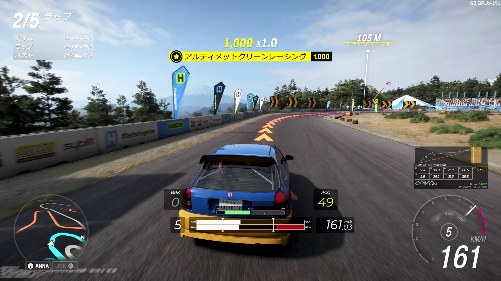

# ArkForzaWidgets



ArkForzaWidgets は、Forza Horizon 6 が UDP で出力するテレメトリ (Data Out) を受信し、ゲーム画面上に半透明オーバーレイで補助情報を表示する Windows 向けデスクトップアプリです。

メインウィンドウは設定パネルとして機能し、オーバーレイは最前面・クリックスルーの透明ウィンドウとして描画されます。ゲーム PC と同一 PC 上で `127.0.0.1` 受信することを前提としています。

## 主な機能

- 表示中ウィジェットを 1 枚にまとめた透明オーバーレイ (最前面・クリックスルー) で HUD を描画
- 速度 / RPM / ギア / スロットル / ブレーキなどの数値表示
- シフトインジケータ表示
- 横 G バー表示
- 前後タイヤのスリップインジケータ表示
- 設定パネル内のダイノグラフ (RPM ごとの Power / Torque ピークホールドとパワーバンド帯)
- 車ごとのギア比 / パワーカーブを `profiles.toml` に保存・読み出し
- 受信した UDP パケットの別ツールへの転送
- グローバルホットキーでプロファイル保存 / クリア

## シフトインジケーターを使用するには  

シフトインジケーターを使用するには、ダイノグラフおよびギア比をプロファイルとして記録し、保存する必要があります。  
以下の手順で記録を実施できます。  

[](https://youtu.be/N6-YM7tbBmo)

## オーバーレイウィジェット

| ラベル | 内容 |
|---|---|
| Stats | 加速度 G やギア比などの統計値 |
| Shift indicator | シフトインジケータ |
| Gear | ギア数値の大型表示 |
| Speed | 速度 (km/h または mph) |
| ACC (text) | アクセル入力 0..=100 のテキスト |
| BRK (text) | ブレーキ入力 0..=100 のテキスト |
| Lateral G bar | 横 G を左右に伸びるバーで表示 |
| Front slip indicator | 前輪のスリップ表示 |
| Rear slip indicator | 後輪のスリップ表示 |
| Telemetry Debug (all fields) | 全フィールドのデバッグ表示 (既定非表示) |

各ウィジェットは設定パネルから表示 / 非表示、位置、スケールを個別に調整できます。

## 動作要件

- Windows 10 / 11 (x64)
- Forza Horizon 6
- Rust 1.96.0 以降 (ソースからビルドする場合)

## 技術スタック

- Rust
- eframe / egui / wgpu
- egui_plot (ダイノグラフ)
- std::net::UdpSocket
- crossbeam-channel
- serde / toml
- windows crate (クリックスルー / DPI / グローバルホットキー)

## 実行方法

```powershell
cargo run
```

リリースビルド:

```powershell
cargo build --release
```

生成物は `target/release/ArkForzaWidgets.exe` です。

## Forza 側設定

ゲーム内の `Settings -> HUD and Gameplay -> Data Out` を開き、以下を設定してください。

| 項目 | 値 |
|---|---|
| Data Out | ON |
| Data Out IP Address | `127.0.0.1` |
| Data Out IP Port | `35530` |
| Data Out Packet Format | `Car Dash` |

`Data Out IP Port` は `config.toml` の `bind` と一致させてください。

## 設定ファイル

初回起動時に `config.toml` と `profiles.toml` が必要に応じて作成されます。既定値は実ファイルではなくソース側 (`src/main.rs::Config::default` と `src/state.rs::Layout`) で決まります。

設定例:

```toml
bind = "0.0.0.0:35530"
settings_size = [520.0, 600.0]
overlay_enabled = true
auto_hide_when_inactive = true
target_processes = ["forzahorizon6.exe"]
gpu_preference = "high_performance"
input_text_bg_alpha = 107
input_text_pad = 6.0
speed_unit_kph = true
g_bar_max_g = 4.0
ignore_inward_slip = true
forward_enabled = false
forward_target = "127.0.0.1:5300"
```

主な設定項目:

- `overlay_enabled`: オーバーレイ全体の ON / OFF
- `auto_hide_when_inactive`: 対象ゲームが前面のときだけ表示
- `target_processes`: フォアグラウンド判定の対象実行ファイル名
- `gpu_preference`: `auto` / `high_performance` / `low_power` (変更はアプリ再起動で有効)
- `input_text_bg_alpha`: ACC / BRK テキスト背景の透明度 (0..=255)
- `input_text_pad`: ACC / BRK テキスト背景の追加パディング
- `speed_unit_kph`: `true` で km/h、`false` で mph
- `g_bar_max_g`: 横 G バーの表示レンジ上限 (G)
- `ignore_inward_slip`: スリップインジケータで内側方向のスリップを無視するか
- `forward_enabled`: 受信した UDP パケットを別ツールへ転送するか
- `forward_target`: 転送先 `IP:Port`

`profiles.toml` には車 / PI ごとのダイノカーブとギア比が保存されます。

## ホットキー

グローバルホットキーで、ゲームが前面のときでも操作できます。

| キー | 動作 |
|---|---|
| `Alt+S` | 現在の車のダイノ / ギア比プロファイルを保存 (未保存かつ記録データがあるときのみ) |
| `Alt+D` | 保存済みプロファイルを削除し、ライブ記録をクリア |

オーバーレイはクリックスルーのため、キーボード / マウス入力を奪いません。

## 配布

配布時の最小構成:

- `target/release/ArkForzaWidgets.exe`
- `config.toml` (任意。無ければ起動時に生成)

## セキュリティ / 公開時の注意

- このアプリは既定でローカル UDP (`127.0.0.1` / `0.0.0.0:35530`) を使用します。
- パケット転送は `forward_enabled = true` のときだけ有効です。
- `config.toml` と `profiles.toml` には個人の設定や走行データが入るため、公開用リポジトリには含めません (`.gitignore` 対象)。
- `target/` 配下の生成物にはローカル環境のパスが含まれるため、公開リポジトリには含めないでください。

## 既知の制限

- `Car Dash` (324 bytes) フォーマット前提です。`Sled` フォーマットは未対応です。
- Windows 専用です。
- 埋め込みフォント (`assets/Montserrat-Italic.ttf`) は SIL Open Font License 1.1 (OFL) です。

## ライセンス

このプロジェクトは zlib License です。詳細は `LICENSE.md` を参照してください。
