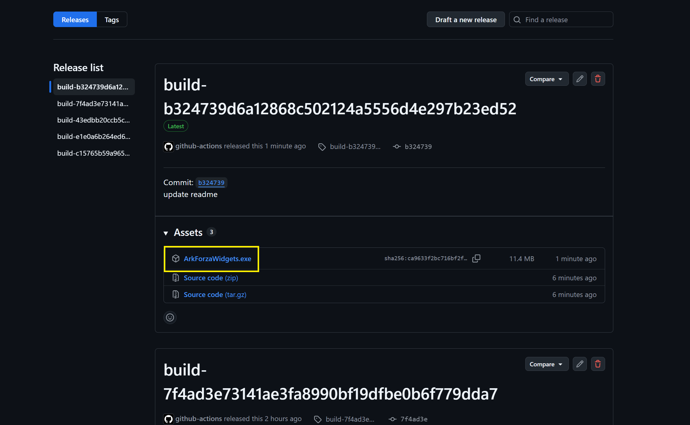
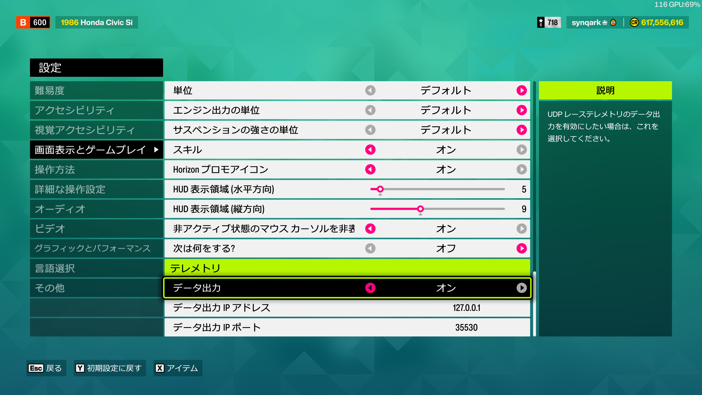

# ArkForzaWidgets

ArkForzaWidgets is a Windows desktop app that receives the UDP telemetry ("Data Out")
broadcast by Forza titles and displays helpful information as an overlay on top of the
game screen.

It lets you place the information you need during a race wherever you like, in a
compact form, so you can build a HUD that's easy to read without taking your eyes far
off the road.

## Download & Install

### Getting and launching the tool

You can download the latest `ArkForzaWidgets.exe` from the `Assets` section at the top
of the [releases page](https://github.com/synqark/ArkForzaWidgets/releases).
Create a folder anywhere you like, place `ArkForzaWidgets.exe` inside it, and launch it.

### Forza settings

Open the in-game `Settings -> HUD and Gameplay -> Data Out` menu and configure it as
shown below.
(Example is for Forza Horizon 6. Adjust the destination IP/port if yours differ.)

## Overlay Widgets

| Label | Description |  |
|---|---|---|
| Stats | Statistics such as acceleration (G) and gear ratios | |
| Shift indicator | Shift indicator | |
| Gear | Large gear number display | |
| Speed | Speed (km/h or mph) | |
| ACC (text) | Throttle input 0..=100 as text | |
| BRK (text) | Brake input 0..=100 as text | |
| Lateral G bar | Shows lateral G as a bar extending left/right | *Hidden by default |
| Front slip indicator | Front tire slip display | *Hidden by default |
| Rear slip indicator | Rear tire slip display | |
| Telemetry Debug (all fields) | Debug display of every field | *Hidden by default |

Each widget's visibility, position, and scale can be adjusted individually from the
settings panel.

## Using the Shift Indicator

To use the shift indicator, you first need to record and save a dyno graph and gear
ratios as a profile for the car. You can do this with the steps below.

## Other Features

- Telemetry relay
  Forwards packets received from Forza to a different port so other tools can use them.
- km/h / mph switching
- GPU switching
  If you run into rendering issues, switching GPUs can sometimes help.

## Requirements

- Windows 10 / 11 (x64)
- Forza Horizon 6
- Rust 1.96.0 or later (only if building from source)
